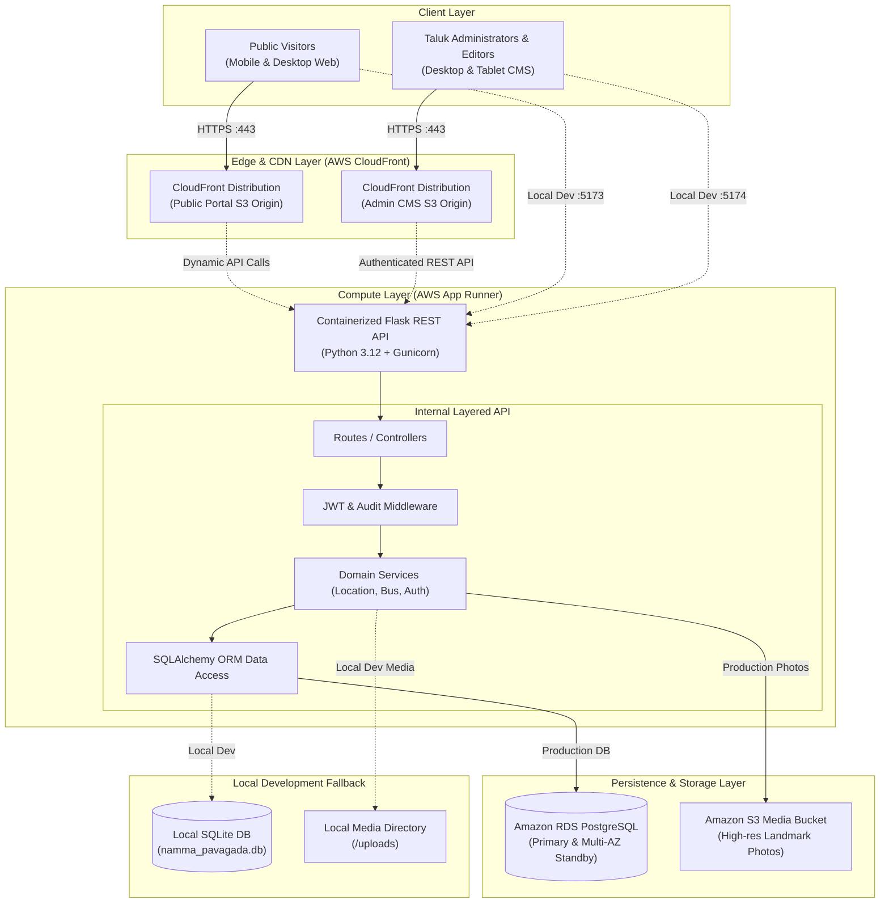
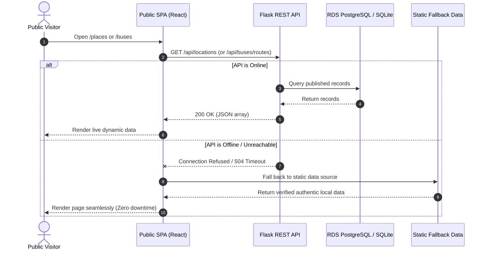
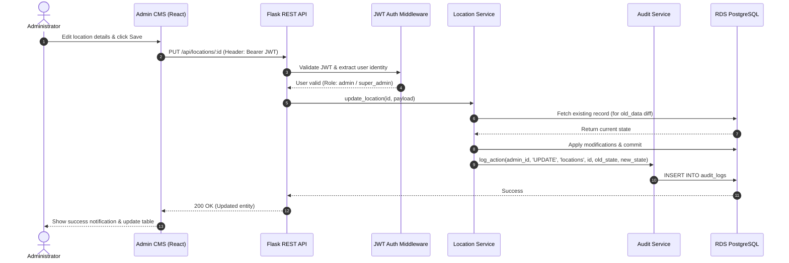
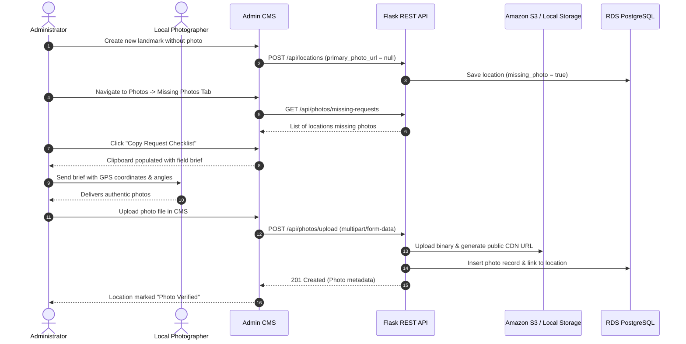

# Namma Pavagada — System Architecture & Design Specification

> Detailed architectural overview of the decoupled multi-tier web application, data flow, component responsibilities, SOLID design principles, and AWS cloud deployment topology.

---

## 1. System Overview

**Namma Pavagada** is engineered as a decoupled, multi-tier web platform designed for high availability, security, and effortless community data curation. The system decouples the end-user public presentation layer, the administrative content management layer, the REST API service, relational persistence, and cloud object storage.

---

## 2. Multi-Tier Decoupled Architecture

The system is strictly partitioned into five independent subsystems:

| Subsystem | Directory | Technology Stack | Hosting / Deployment | Responsibilities |
| :--- | :--- | :--- | :--- | :--- |
| **Public Frontend** | `frontend/` | React 19, TypeScript, Vite, Tailwind CSS, Leaflet | AWS S3 + CloudFront CDN | Public web portal, interactive maps, bus schedule search, hospital directory, historical eras, offline fallback data. |
| **Admin CMS** | `admin-frontend/` | React 19, TypeScript, Vite, Tailwind CSS, Lucide | AWS S3 + CloudFront CDN | Authenticated administrative backoffice, CRUD operations, bus stop sequencer, missing photo workflows, audit logs. |
| **REST API Backend** | `backend/` | Python 3.12, Flask, Flask-SQLAlchemy, PyJWT, Bcrypt, Boto3 | AWS App Runner (Docker) | Business logic, authentication, authorization, validation, audit trail capture, S3 pre-signed upload handling. |
| **Relational Database** | `database/` | PostgreSQL 16 / Amazon RDS (SQLite for dev) | AWS RDS (Multi-AZ) | ACID transactional store, relational integrity, foreign keys, historical citations, audit logs. |
| **Media Storage** | `backend/uploads/` & AWS S3 | Amazon S3 with CORS (Local disk for dev) | AWS S3 Standard | Storage of authentic photography, image metadata, CDN caching. |

---

## 3. Component Breakdown & Responsibilities

### 3.1 Public Frontend (`frontend/`)
- **Single Page Application (SPA)**: Ultra-fast initial load via Vite bundle optimization and Tailwind CSS tree-shaking.
- **Resilient Offline Architecture**: Every frontend service (`locationService.ts`, `mapService.ts`, `serviceDirectoryService.ts`, `historyService.ts`) is programmed with a failover circuit:
  1. Attempts to query the live REST API at `/api/...`.
  2. If the backend is unreachable (e.g. cold start, network outage, or offline demo mode), it seamlessly returns verified authentic local data from `src/data/*.ts`.
  3. The end-user **never encounters a blank screen or unhandled error state**.
- **Interactive Mapping**: Leaflet-based spatial visualizer rendering categorized markers for Pavagada Fort, temples, solar park, bus stands, and schools with popup summaries and GPS coordinates.
- **Zero Secrets Exposure**: The public frontend contains zero AWS credentials, database keys, or administrative tokens.

### 3.2 Admin CMS (`admin-frontend/`)
- **JWT Session Management**: Tokens stored securely in `sessionStorage` with automated refresh and session expiry redirection.
- **Dynamic Category Registration**: Allows adding new Taluk modules (e.g., Agriculture, Weather) dynamically without altering frontend source code.
- **Interactive Bus Route Sequencer**: Visual interface to define routes (e.g., Pavagada to Tumakuru), add stops, reorder stops with up/down controls, and configure trip timings categorized by Day Type (All Days, Weekday, Weekend).
- **Missing Photo Request Workflow**: Identifies all registered locations lacking authentic photography. Generates an instant Markdown checklist that administrators can copy and send to field volunteers in Pavagada.
- **Comprehensive Audit Trail Viewer**: Full chronological log of all database mutations, recording the acting administrator, IP address, timestamp, affected record, and old/new JSON diffs.
- **Cloud Infrastructure Health Dashboard**: Real-time status indicators checking the connectivity and latency of the REST API, Amazon RDS PostgreSQL, and Amazon S3.

### 3.3 Backend REST API (`backend/`)
Built according to **Layered Architecture** principles:
- **Presentation Layer (`app/routes/`)**: Flask blueprints parsing HTTP requests, query parameters, path variables, and returning standardized JSON envelopes.
- **Middleware Layer (`app/middleware/`)**:
  - `auth_middleware.py`: `@require_admin` and `@require_roles` decorators verifying RS256/HS256 JWT tokens.
  - `error_handler.py`: Centralized error interceptor ensuring consistent `{ "error": true, "message": "...", "status_code": 4xx/5xx }` payloads.
- **Service Layer (`app/services/`)**: Pure business logic isolation:
  - `location_service.py`: Spatial coordinate validation, category assignment, slug generation, status filtering.
  - `bus_service.py`: Stop sequence indexing, schedule conflicts, transit graph representation.
  - `s3_service.py`: Boto3 S3 upload management with automatic local disk fallback.
  - `audit_service.py`: Immutable audit logging for every create, update, and delete action.
  - `search_service.py`: Multi-entity cross-domain search across locations, routes, and medical services.
- **Data Access Layer (`app/models/`)**: SQLAlchemy declarative models enforcing foreign keys, cascading deletions, indices, and serialization helpers (`to_dict()`).

---

## 4. SOLID Design Principles Implementation

| Principle | Application in Namma Pavagada Architecture |
| :--- | :--- |
| **Single Responsibility Principle (SRP)** | Each module has exactly one reason to change. `LocationService` handles only location validation and data retrieval; `S3Service` handles only file storage; `AuditService` handles only change tracking. |
| **Open/Closed Principle (OCP)** | The dynamic `Category` registry enables adding new modules (e.g. `veterinary_services`, `solar_park_visitation`) with unique badge styles without modifying the database schema or code. |
| **Liskov Substitution Principle (LSP)** | `S3Service` exposes identical method signatures (`upload_file`, `delete_file`, `get_file_url`) whether operating against Amazon S3 in cloud production or local disk storage in development. |
| **Interface Segregation Principle (ISP)** | Public client endpoints receive lean, optimized payloads (e.g. `/api/locations/map` returns only IDs, coordinates, titles, and categories) to minimize mobile bandwidth, while `/api/admin/locations` returns full audit and metadata. |
| **Dependency Inversion Principle (DIP)** | High-level business logic depends on abstract interfaces and configuration injection (`create_app(config_name)`) rather than concrete database drivers or fixed cloud credentials. |

---

## 5. End-to-End Data Flow

### 5.1 Public Client Read Flow (With Offline Fallback)

### 5.2 Admin Mutation & Audit Trail Flow

### 5.3 Photo Request & Resolution Workflow

---

## 6. Security & Hardening Architecture

1. **Authentication & Password Storage**:
   - Passwords hashed using standard `bcrypt` with salt rounds ($2b$12).
   - JWT tokens signed with HS256/RS256 secret, expiring after 24 hours.
   - Refresh tokens stored in HTTP-only, Secure, SameSite cookies.
2. **Access Control (RBAC)**:
   - Three distinct roles: `super_admin`, `admin`, and `editor`.
   - Modifying admin accounts and viewing audit logs restricted to `super_admin`.
3. **Network Isolation (AWS VPC)**:
   - RDS PostgreSQL is provisioned exclusively in **Private Subnets** with no internet gateway route.
   - App Runner tasks reside in VPC with a VPC connector, accessing the database via private security group rules.
4. **CORS Policy**:
   - Backend enforces strict allowed origins matching the production CloudFront domains and `localhost:5173` / `localhost:5174` for local testing.
5. **Protection of Local Heritage & Primary Sources**:
   - Historical records require non-empty citation fields (`primary_source_citation`).
   - Audit logs are immutable (append-only); there is no endpoint or UI to delete audit records.

---

## 7. Scalability & Extensibility

The decoupled architecture easily accommodates future modules for Pavagada Taluk:
- **Agricultural APMC Market Rates**: Add an APMC model and route blueprint; the public and admin frontends dynamically read categories to display daily groundnut and ragi prices.
- **Solar Park Environmental Monitoring**: Integration with Karnataka Solar Power Development Corp (KSPDCL) telemetry via webhook ingestion.
- **Multi-lingual Support (Kannada & English)**: Database schema includes localized text fields (`title_kn`, `description_kn`), ready for bi-lingual content delivery.
