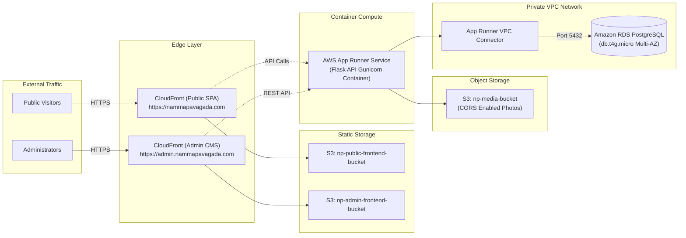

# Namma Pavagada — AWS Production Deployment & Cloud Architecture Guide

> Step-by-step guide for deploying Namma Pavagada to Amazon Web Services (AWS) using modular CloudFormation templates, Docker, Amazon App Runner, RDS PostgreSQL, S3, and CloudFront.

---

## 1. Cloud Architecture Overview

Namma Pavagada is designed to run natively on AWS utilizing cost-effective, managed serverless and containerized services:



---

## 2. Infrastructure Components

| AWS Service | Resource | Purpose |
| :--- | :--- | :--- |
| **AWS App Runner** | Container Service | Runs the Python 3.12 Flask REST API with automatic scaling, health checks, and zero container orchestration overhead. |
| **Amazon RDS** | PostgreSQL 16 (`db.t4g.micro`) | High-durability managed relational database deployed across private subnets. |
| **Amazon S3 (Media)** | `namma-pavagada-media` | Stores authentic high-resolution landmark photography and photo assets. |
| **Amazon S3 (Frontends)** | Static Hosting Buckets | Hosts pre-built React Single Page Applications (`frontend/dist` and `admin-frontend/dist`). |
| **Amazon CloudFront** | CDN Distributions | Low-latency global edge caching, SSL/TLS termination, and SPA routing rewrites. |
| **AWS VPC** | 2 Public & 2 Private Subnets | Isolates database and application compute from public internet attack surfaces. |
| **AWS ECR** | Elastic Container Registry | Stores signed Docker container images of the Flask API. |

---

## 3. Prerequisites

Before starting deployment, ensure you have:
1. An **AWS Account** with administrative permissions.
2. **AWS CLI v2** installed and configured:
   ```bash
   aws configure
   # Set AWS Access Key ID, Secret Access Key, and Default Region (e.g. ap-south-1 Mumbai)
   ```
3. **Docker Desktop** installed and running.
4. **Python 3.12** and **Node.js 20+** installed locally.

---

## 4. Step-by-Step CloudFormation Deployment

All CloudFormation templates are organized under `infrastructure/aws/cloudformation/`.

### Step 4.1: Deploy VPC Network (`01-vpc-network.yaml`)
Provisions a dedicated VPC with 2 public subnets (for internet-facing load balancers / NAT) and 2 private subnets (for RDS PostgreSQL).

```bash
aws cloudformation deploy \
  --template-file infrastructure/aws/cloudformation/01-vpc-network.yaml \
  --stack-name np-vpc-stack \
  --parameter-overrides \
    Environment=production \
    VpcCIDR=10.0.0.0/16 \
  --capabilities CAPABILITY_IAM \
  --region ap-south-1
```

---

### Step 4.2: Deploy RDS PostgreSQL (`02-rds-postgres.yaml`)
Provisions a managed PostgreSQL 16 database in the private subnets with security group isolation.

```bash
aws cloudformation deploy \
  --template-file infrastructure/aws/cloudformation/02-rds-postgres.yaml \
  --stack-name np-rds-stack \
  --parameter-overrides \
    Environment=production \
    DBName=namma_pavagada \
    DBMasterUsername=npadmin \
    DBMasterPassword=ChangeMeSecurePass2026! \
    DBInstanceClass=db.t4g.micro \
    MultiAZ=false \
  --region ap-south-1
```

> [!NOTE]
> Set `MultiAZ=true` for production high availability with automatic standby failover.

---

### Step 4.3: Deploy S3 Media Bucket & Configure CORS (`03-s3-media.yaml`)
Creates the Amazon S3 bucket for photos with public read policy and CORS headers for uploads.

```bash
aws cloudformation deploy \
  --template-file infrastructure/aws/cloudformation/03-s3-media.yaml \
  --stack-name np-s3-media-stack \
  --parameter-overrides \
    Environment=production \
    BucketName=namma-pavagada-media-prod \
  --region ap-south-1
```

To configure and verify CORS permissions on the S3 bucket using the automation script:
```bash
python infrastructure/scripts/setup-s3-cors.py --bucket namma-pavagada-media-prod --region ap-south-1
```

---

### Step 4.4: Build & Push Backend Container to Amazon ECR

1. Create an ECR repository:
   ```bash
   aws ecr create-repository --repository-name namma-pavagada-backend --region ap-south-1
   ```
2. Authenticate Docker with ECR:
   ```bash
   aws ecr get-login-password --region ap-south-1 | docker login --username AWS --password-stdin <YOUR_ACCOUNT_ID>.dkr.ecr.ap-south-1.amazonaws.com
   ```
3. Build and tag the Docker image:
   ```bash
   docker build -t namma-pavagada-backend -f infrastructure/docker/backend.Dockerfile .
   docker tag namma-pavagada-backend:latest <YOUR_ACCOUNT_ID>.dkr.ecr.ap-south-1.amazonaws.com/namma-pavagada-backend:latest
   ```
4. Push to ECR:
   ```bash
   docker push <YOUR_ACCOUNT_ID>.dkr.ecr.ap-south-1.amazonaws.com/namma-pavagada-backend:latest
   ```

---

### Step 4.5: Deploy App Runner Backend API (`04-backend-apprunner.yaml`)
Provisions the containerized Flask service connected to the VPC and RDS.

```bash
aws cloudformation deploy \
  --template-file infrastructure/aws/cloudformation/04-backend-apprunner.yaml \
  --stack-name np-backend-stack \
  --parameter-overrides \
    Environment=production \
    ImageUri=<YOUR_ACCOUNT_ID>.dkr.ecr.ap-south-1.amazonaws.com/namma-pavagada-backend:latest \
    DatabaseUrl=postgresql://npadmin:ChangeMeSecurePass2026!@<RDS_ENDPOINT>:5432/namma_pavagada \
    JwtSecretKey=SuperSecretProductionJWTKey2026! \
    S3BucketName=namma-pavagada-media-prod \
    AwsRegion=ap-south-1 \
  --capabilities CAPABILITY_IAM \
  --region ap-south-1
```

---

### Step 4.6: Deploy CloudFront & S3 Static Frontends (`05-frontend-cloudfront.yaml`)
Creates S3 static hosting buckets and CloudFront distributions for both the Public Website and Admin CMS.

```bash
aws cloudformation deploy \
  --template-file infrastructure/aws/cloudformation/05-frontend-cloudfront.yaml \
  --stack-name np-frontends-stack \
  --parameter-overrides \
    Environment=production \
    PublicDomainName=nammapavagada.com \
    AdminDomainName=admin.nammapavagada.com \
  --region ap-south-1
```

---

### Step 4.7: Build & Sync Frontends to S3

```bash
# 1. Build Public Frontend
cd frontend
VITE_API_URL=https://api.nammapavagada.com/api npm run build
aws s3 sync dist/ s3://np-public-frontend-prod-bucket --delete

# 2. Build Admin CMS
cd ../admin-frontend
VITE_API_URL=https://api.nammapavagada.com/api npm run build
aws s3 sync dist/ s3://np-admin-frontend-prod-bucket --delete

# 3. Invalidate CloudFront Caches
aws cloudfront create-invalidation --distribution-id <PUBLIC_CF_ID> --paths "/*"
aws cloudfront create-invalidation --distribution-id <ADMIN_CF_ID> --paths "/*"
```

---

## 5. Automated CI/CD Deployment with GitHub Actions

The repository includes a ready-to-run GitHub Actions workflow located at `.github/workflows/deploy.yml`:
1. **Continuous Integration**: Triggers on pull requests and pushes to `main`.
   - Runs `pytest` automated tests on the Flask backend.
   - Compiles TypeScript and runs Vite builds for both `frontend/` and `admin-frontend/`.
2. **Continuous Deployment**: On pushes to `main`:
   - Builds and tags the Docker image, pushing to Amazon ECR.
   - Updates the AWS App Runner deployment.
   - Syncs compiled frontend assets to Amazon S3 and invalidates CloudFront edge caches.

---

## 6. AWS Cost & Free-Tier Optimization Analysis

The architecture is deliberately chosen to fit within the **AWS 12-Month Free Tier** or incur minimal cost for a community taluk portal:

| AWS Service | Free Tier Allowance | Estimated Monthly Cost (Free Tier Active) | Estimated Monthly Cost (After Free Tier) |
| :--- | :--- | :--- | :--- |
| **Amazon RDS (PostgreSQL)** | 750 hours/month of `db.t4g.micro` + 20 GB SSD storage | **$0.00** | ~$13.50 / month |
| **Amazon S3 (Media & Frontends)** | 5 GB standard storage + 20,000 GET requests | **$0.00** | ~$0.25 / month |
| **Amazon CloudFront** | 1 TB data transfer out per month (Always Free) | **$0.00** | **$0.00** |
| **AWS App Runner** | Pay-as-you-go based on vCPU-hours and GB-hours (~$0.007/GB-hour memory idle, scales down) | ~$5.00 / month | ~$5.00 - $12.00 / month |
| **Total Estimated Cost** | — | **~$5.00 / month** | **~$18.00 - $25.00 / month** |

---

## 7. Security Best Practices

1. **VPC Subnet Isolation**: The RDS PostgreSQL instance is never exposed to the public internet; it can only accept connections from the App Runner VPC connector on port 5432.
2. **Environment Variable Protection**: Database passwords and JWT secret keys should be stored in **AWS Secrets Manager** or **AWS Systems Manager Parameter Store** in production.
3. **CORS Enforcement**: S3 media bucket CORS is locked to `https://admin.nammapavagada.com` and `https://nammapavagada.com`.
4. **HTTPS Enforcement**: CloudFront enforces automatic HTTP-to-HTTPS redirection with TLS 1.3 encryption.
